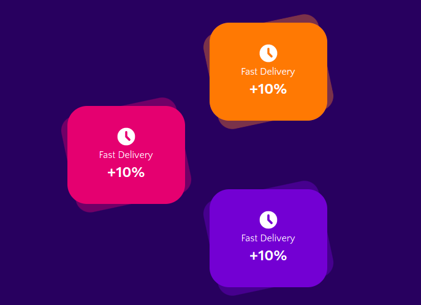

# CTA-card-component



```html
<div class="relative">
  <!-- Set your faded color -->
  <div
    class="w-36 h-36 xl:w-48 xl:h-40 rounded-3xl -rotate-12 opacity-40 bg-teal-500"
  ></div>
  <!-- Set your primary color for the CTA card -->
  <div
    class="w-36 h-36 xl:w-48 xl:h-40 rounded-[2rem] rotate-0 absolute top-0 left-0 bg-teal-700"
  >
    <div class="grid flex-col justify-items-center m-auto mt-8">
      <h3 class="h3 text-white mb-0">
        <!-- You Icon of choice -->
        <svg
          xmlns="http://www.w3.org/2000/svg"
          class="h-9 w-9"
          viewBox="0 0 20 20"
          fill="currentColor"
        >
          <path
            fill-rule="evenodd"
            d="M10 18a8 8 0 100-16 8 8 0 000 16zm1-12a1 1 0 10-2 0v4a1 1 0 00.293.707l2.828 2.829a1 1 0 101.415-1.415L11 9.586V6z"
            clip-rule="evenodd"
          ></path>
        </svg>
      </h3>
      <p class="text-base text-white mb-0">CPU Usage</p>
      <h4 class="h4 text-white mb-0">+100%</h4>
    </div>
  </div>
</div>
```
